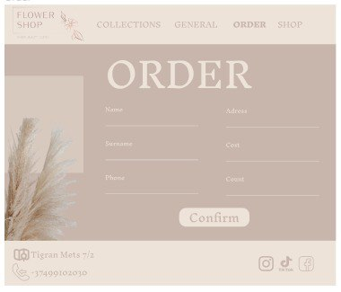

# FLOWERS BOUTIQUE

## Directory stracture

```
.
├── index.html
|   ├── Components
│   |   ├── Css
│   │   │   ├── collections
│   │   |   ├── footer
│   │   │   ├── general
|   |   │   ├── header
│   │   │   └── shop
|   |   ├── Images
│   │   │
│   │   ├── Js
│   │   │    ├── collections
│   │   │    ├── footer
│   │   │    ├── general
|   |   │    ├── header
│   │   │    └── shop
```

## Installation 

```
git clone https://github.com/htc4/Qristine.git
```

## Usage 

Open Qristine directory -> index.html file


## Description

When you open index.html file, the following page opens. It's a general page in website. 
You can go to "shop", "collections" and "order" pages.


In shop page you can buy your favourite bouquet.


In collections page you can get to know our assortment and register an order.


In order page you can do an individual orders.



You can communicate with our operators and get answers to your questions.


## Demo version
 https://www.figma.com/proto/4HKXC8HGMSTs4PuVJgAfje/Untitled?type=design&node-id=265-240&t=hCtMXXbqhJhrBTHr-0&scaling=min-zoom&page-id=265%3A240&starting-point-node-id=265%3A274
